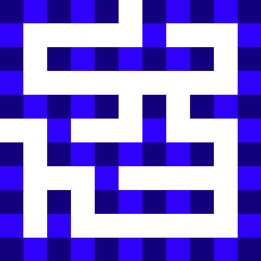
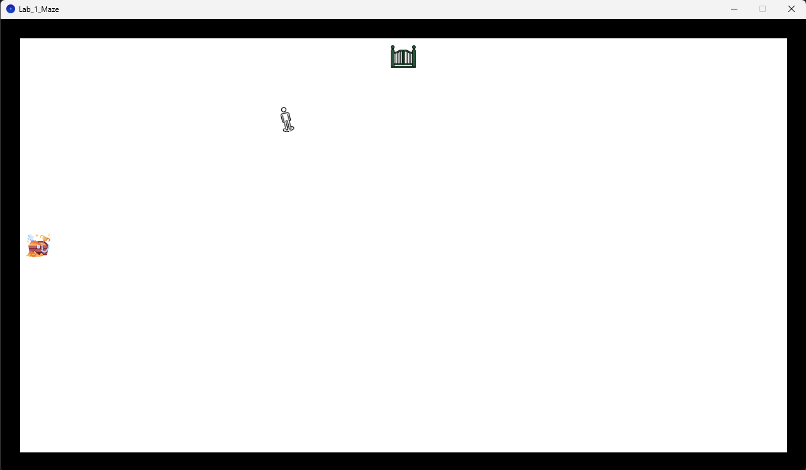
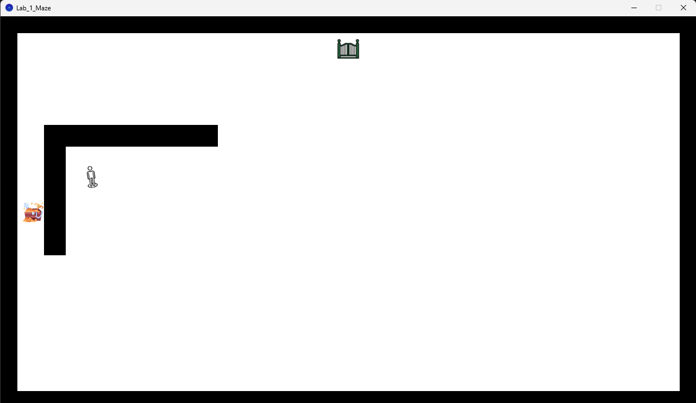
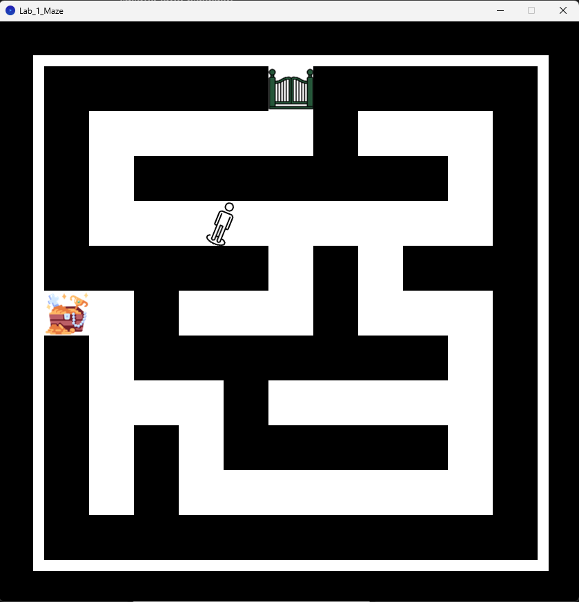

### Index

- [Setup](https://github.com/GAmuzak/CanHap-Labs/tree/main/Lab_1_Maze#setup)
- [Maze Design](https://github.com/GAmuzak/CanHap-Labs/tree/main/Lab_1_Maze#maze-design)
- [Iterative Improvements](https://github.com/GAmuzak/CanHap-Labs/tree/main/Lab_1_Maze#iterative-improvements)
- [Conclusion](https://github.com/GAmuzak/CanHap-Labs/tree/main/Lab_1_Maze#conclusion)

---

# Setup

Since our node currently does not have access to the gen 3 2diy, we used the previous cohort’s already assembled gen 2 2diy boards.

The software setup was easy enough to follow along, and all the sample codes worked with some minor parameter changes for the selected port. The current issue is the assumption is the first available serial port will be the haply board, however it doesn’t seem to work the same on PCs. This causes some minor issues with git syncing the project across multiple computers (home and lab), however it is a minor nitpick and might be potentially resolved with the gen3 devices (and maybe smarter error handling).

---

# Maze Design

For designing mazes quickly, I found this online tool called (somewhat bluntly) [Online Maze Designer](https://www.theedkins.co.uk/jo/maze/makemaze/index.htm). It contained a helpful guide on quickly designing fun mazes, and I finalized on the following parameters:

Size: 11

Maze Data: `111000111011011010100011101100011011011011100011010110100011111111111111`



Implementing this with the `FBox` class would be straightforward and too trivial, so I decided to also implement a fog mechanic, which would wipe away as the player explored different parts of the maze. This way the experience is a visuo-haptic one, and the player can use their “past experience” to avoid going back on already explored sections.

# Iterative Improvements
First I setup a base world using the Fisica maze example as a template, and removing everything except for the start and end circles. Putting the cursor over the start circle starts the game, and reaching the end circle will end the game. The only way to test this right now is based on the `setSensor` parameter of the Haptic Tool being set to false on start of the game, and true on end. I then positioned them to the indended start and end positions. I also updated the icons to have a gate and treasure.



Next, I wanted to create the walls of the maze. I noticed however that to create a wall from the maze example, a lot of the code was very redundant. So I decided to make a simple `FWall`  class to extend the functionality of `FBox`  to make walls with a single line of code (well, 2 if you count adding it to the world). I also wanted the x and y parameters to be the starting point for the walls generation, so I offset the position with half the width and height. This was purely to make it easier to think about the walls growing from a point, and I could consider the grid similar to the maze I generated above.



Again using the Maze sample code as a reference, I noticed the walls were being enabled and disabled manually, so I made an arraylist which I used to keep a reference for all created walls. I could then switch them on or off in a loop in the draw method.

```java
if(gameStart){
    for(FBox wall : walls){
        wall.setFill(0, 0, 0);
    }
}
else{
    for(FBox wall : walls){
        wall.setFill(255, 255, 255);
    }
}
```

I also rescaled everything so the maze was 13x13 units with a 840x840 pixel window. This allowed me to use the boxes from the maze generator as reference units to quickly make the maze.



Now for the wall reveal mechanic, I added a `bumped` parameter to the walls, and simply switched it to true if any of them made contact in the simulation loop. Then I updated my drawing code to only draw walls which were “bumped”. The final result looked like this.


https://github.com/GAmuzak/CanHap-Labs/assets/53485887/1e3e2824-8d64-4d87-9fe6-86df53eb748a


I still wasn’t too happy with the maze generation technique with all the walls, and decided I want to upgrade it to read from my maze data line and generate single boxes on the basis of that.

So I looked into how to feed data into processing, and managed to feed a text file containing 1s and 0s representing my maze into a 2d array, which I then used to construct my maze with individual fboxes. This implementation is a lot cleaner than generating 13 big walls.

```java
// loading data
String[] data = loadStrings("MazeData.txt");
int[][] mazeData = new int[11][11];
for (int i = 0; i < 11; ++i) {
    String[] values = split(data[i], " ");
    if(values.length==11){
        for (int j = 0; j < values.length; ++j) {
            mazeData[i][j] = int(values[j]);
        }
    }
}
//generating maze
for (int i = 0; i < mazeData.length; ++i) {
    for (int j = 0; j < mazeData[i].length; ++j) {
        if(mazeData[i][j]==1){
            FWall wall = new FWall(j+1, i+1, 1, 1);
            walls.add(wall);
            world.add(wall);
        }
    }
}
```

Another thing I like about this approach is the maze now reveals itself much more gradually, and actually requires the player to explore a lot more.


https://github.com/GAmuzak/CanHap-Labs/assets/53485887/7b1cd7f0-b3c7-47e1-b97f-13f0f7e0da8f


This would be around the time I would go ahead and fixed the player icon, but I’ve grown too fond of my Spinny Boi, so he’ll be sticking around. Who knows, he might show up in the next assignment too :D

# Conclusion

This was an extremely fun assignment! I really enjoyed iteratively improving the maze and improving my code base from a rough playable prototype to the final product. I would consider randomly generating the maze, but unfortunately I had no time last week to work on this assignment, and I’m submitting this on the eleventh hour as it is. But I might tweak the code on GitHub down the line, so if the maze changes each round then future me has succeeded in randomly generating the maze!
